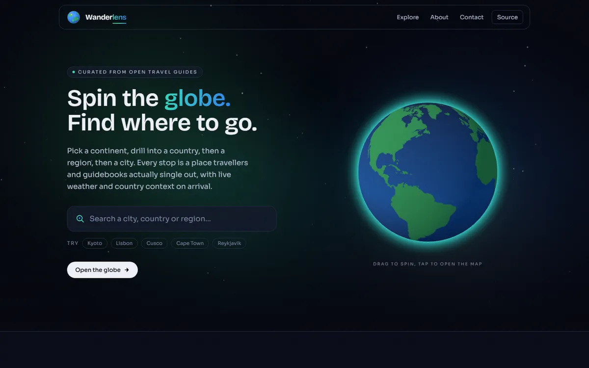
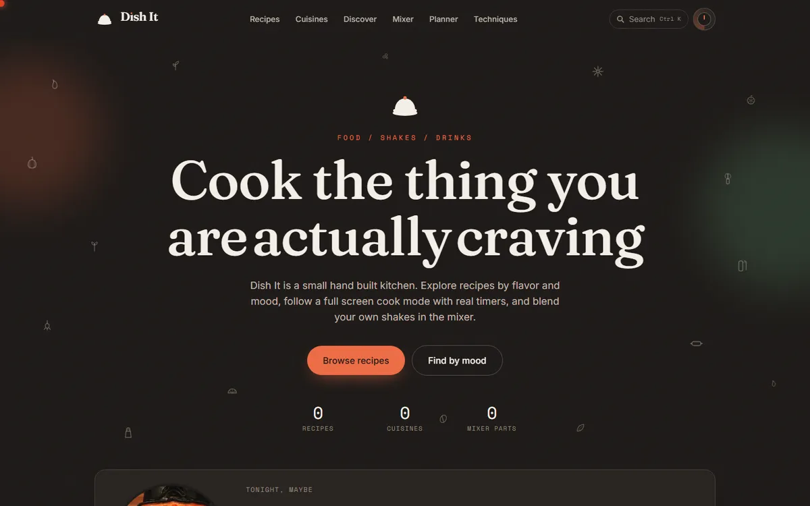
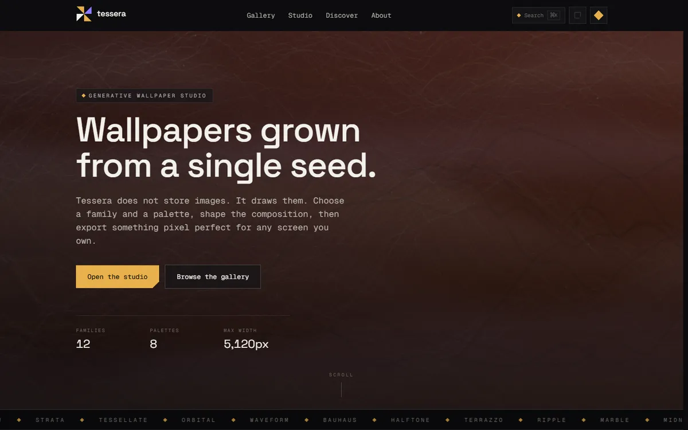
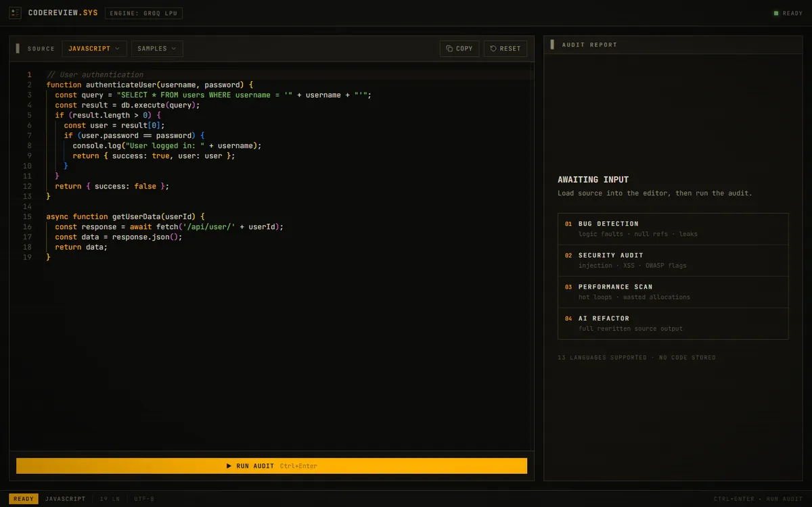
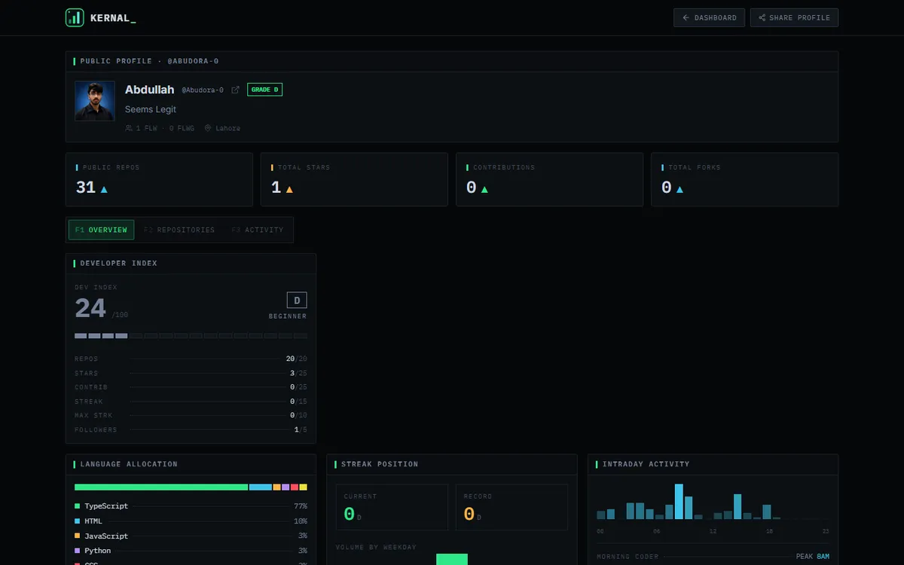
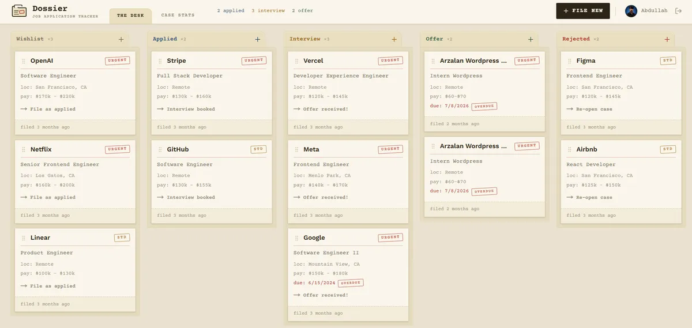
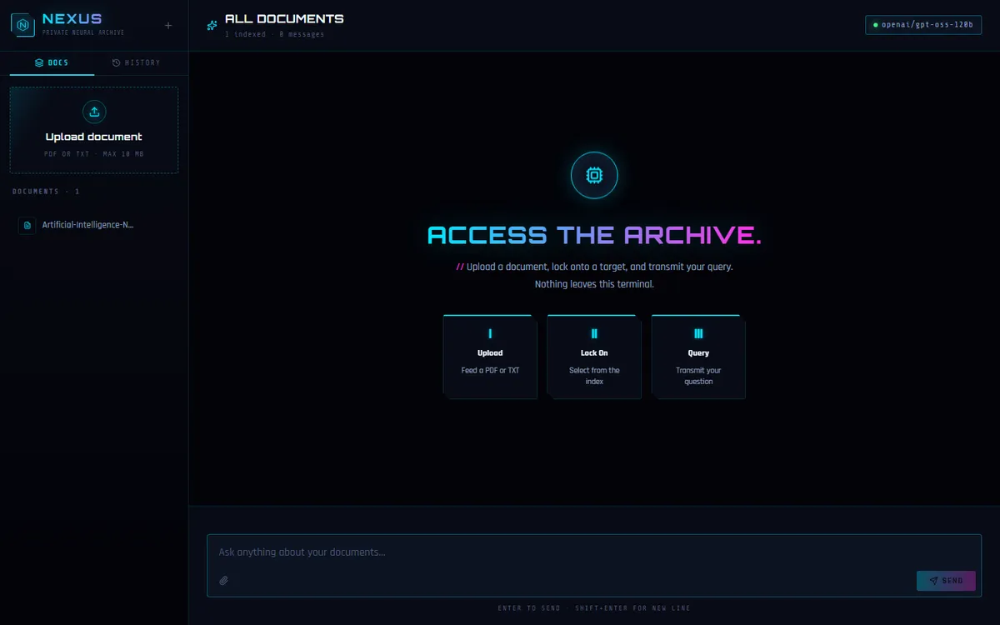
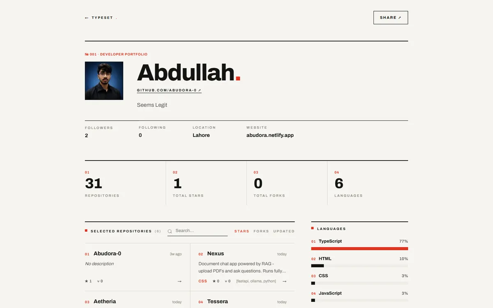

<div align="center">



<br />

**Eight shipped products, each built inside its own deliberate design language.**

[**abudora-resume.vercel.app**](https://abudora-resume.vercel.app)

[](https://nextjs.org)
[](https://react.dev)
[](https://www.typescriptlang.org)
[](https://tailwindcss.com)
[](https://vercel.com)
[](LICENSE)

`portfolio` &nbsp; `nextjs` &nbsp; `react` &nbsp; `typescript` &nbsp; `tailwindcss` &nbsp; `design-systems` &nbsp; `full-stack` &nbsp; `rag`

</div>

---

## Muhammad Abdullah

Frontend and full-stack engineer. This repository is the source for
[abudora-resume.vercel.app](https://abudora-resume.vercel.app), an exhibition
catalogue indexing eight shipped products, each one built inside its own
deliberate visual system rather than a shared component kit. Zero backend
static apps, full-stack products with a real database and auth, and a
local-first RAG pipeline are all represented below, with a live screenshot,
the design language, the stack and the links for each.

[Wanderlens](#wanderlens) &nbsp;&middot;&nbsp; [Dish It](#dish-it) &nbsp;&middot;&nbsp; [Tessera](#tessera) &nbsp;&middot;&nbsp; [CODEREVIEW.SYS](#codereview-sys) &nbsp;&middot;&nbsp; [Kernal](#kernal) &nbsp;&middot;&nbsp; [Dossier](#dossier) &nbsp;&middot;&nbsp; [Nexus](#nexus) &nbsp;&middot;&nbsp; [Typeset](#typeset)

---

## The work

<a id="wanderlens"></a>

### 01 &middot; [Wanderlens](https://github.com/Abudora-0/wanderlens)

*Spin a 3D globe, drop into any place on Earth, get the trip worth taking.*

<a href="https://wanderlenss.vercel.app"></a>

**Design language.** Aperture optics. A photographic lens as the interface: an iris that opens on load, deep space blues, hairline reticles.

Type a place or click a country on an interactive three.js globe and Wanderlens assembles one briefing: the best places to visit, blended and de-duplicated from Wikivoyage and geo-tagged Wikipedia, live weather with a seven day outlook, and full country context with animated counters. Every data source is fetched independently, so one slow or failing API degrades the page instead of breaking it.

- Interactive WebGL globe with a cobe-rendered fallback
- Six open datasets merged, ranked and attributed at runtime
- No API keys, no accounts, no trackers, no database

      

[Live demo](https://wanderlenss.vercel.app) &nbsp;&middot;&nbsp; [Source](https://github.com/Abudora-0/wanderlens)

---

<a id="dish-it"></a>

### 02 &middot; [Dish It](https://github.com/Abudora-0/Dish-It)

*Cook the thing you are actually craving.*

<a href="https://dish-itt.vercel.app"></a>

**Design language.** The interface is the food. The scrollbar drips like sauce, counters roll like an old till, the theme switch is a stove dial, dropdowns open like a lifting pot lid.

An animated recipe kitchen for food, shakes and drinks. Explore by flavour and mood on a draggable craving wheel, follow a full screen cook mode with stacking countdown timers and a screen wake lock, and build layered drinks in a mixer that fills the glass as you drop parts in. A saved cookbook, a categorised shopping list and a drag and drop weekly meal planner all live on-device with no account.

- Full screen cook mode with stacking timers and servings scaling
- Drink mixer with live nutrition, a flavour radar and URL-encoded share links
- Command palette, per-recipe OG images, Recipe JSON-LD, PWA, a Konami code

      

[Live demo](https://dish-itt.vercel.app) &nbsp;&middot;&nbsp; [Source](https://github.com/Abudora-0/Dish-It)

---

<a id="tessera"></a>

### 03 &middot; [Tessera](https://github.com/Abudora-0/tessera)

*A generative wallpaper studio. It does not store images, it draws them.*

<a href="https://tesseera.vercel.app"></a>

**Design language.** Gallery instrument. Warm graphite, a single amber accent, Space Grotesk over Geist Mono, a shelf you curate. Calm chrome around a loud canvas.

Pick one of six drawing families, Waveform, Bauhaus, Halftone, Terrazzo, Ripple or Marble, and a palette, then tune seed, density, contrast, detail and turbulence until the composition is yours. Everything renders deterministically on a 2D canvas with no WebGL dependency, then exports pixel perfect for any phone, tablet or desktop up to 5K.

- Six procedural drawing algorithms driven by simplex noise flow fields
- Deterministic seeds, so every wallpaper is a shareable number
- Pixel perfect export at device presets or a custom size

      

[Live demo](https://tesseera.vercel.app) &nbsp;&middot;&nbsp; [Source](https://github.com/Abudora-0/tessera)

---

<a id="codereview-sys"></a>

### 04 &middot; [CODEREVIEW.SYS](https://github.com/Abudora-0/CODEREVIEW.SYS)

*Paste code, get a structured review in seconds: bugs, security, performance, refactor.*

<a href="https://codereview-sys.vercel.app"></a>

**Design language.** Phosphor audit terminal. Warm graphite and an amber CRT accent, all JetBrains Mono, faint scanlines, zero border radius, a segmented instrument gauge, compiler-style diagnostics and a vim status line.

An AI code review tool that analyses a snippet and returns an animated quality gauge with a stamped verdict, bug detection with exact line numbers, OWASP-style security findings, performance suggestions and a fully rewritten version of the code. Thirteen languages, a Monaco editor, one-click export of the full report as Markdown, and Ctrl+Enter to run.

- Animated instrument gauge scoring 0 to 100 with a stamped verdict
- Line accurate bug, security and performance diagnostics
- Groq and Llama 3.3 70B, Monaco editor, Markdown export

     

[Live demo](https://codereview-sys.vercel.app) &nbsp;&middot;&nbsp; [Source](https://github.com/Abudora-0/CODEREVIEW.SYS)

---

<a id="kernal"></a>

### 05 &middot; [Kernal](https://github.com/Abudora-0/Kernal)

*Your GitHub activity as a Bloomberg terminal.*

<a href="https://kernall.vercel.app"></a>

**Design language.** Financial market terminal. Deep navy-black panels with signal green ticks, IBM Plex Mono readouts with tabular numerals, dotted leader lines, function key tabs and a segmented DEV INDEX gauge.

A GitHub-integrated developer dashboard that turns public activity into a data-rich profile: a letter-grade developer score derived from real metrics, a contribution heatmap, current and longest streaks, a language breakdown, top repositories, an activity feed and an hourly heatmap. Sign in with GitHub for your own dashboard, or look up any public username at a shareable URL.

- Letter-grade DEV INDEX computed from live GitHub REST and GraphQL data
- Contribution graph, streak tracking and hourly activity heatmap
- GitHub OAuth, shareable public profile pages

      

[Live demo](https://kernall.vercel.app) &nbsp;&middot;&nbsp; [Source](https://github.com/Abudora-0/Kernal)

---

<a id="dossier"></a>

### 06 &middot; [Dossier](https://github.com/Abudora-0/Dossier)

*A Kanban job application tracker that looks like a paper dossier desk.*

<a href="https://dosssier.vercel.app"></a>

**Design language.** Paper dossier desk. Warm cream ground, manila folder columns with real tabs, applications as ruled index cards, priorities as tilted rubber stamps, Courier Prime typewriter labels.

Drag applications through five folders, from Wishlist to Applied to Interview to Offer to Rejected, with deadline tracking that auto-highlights overdue cards in red, colour-coded priority flags, search and filter, and a statistics dashboard of pipeline counts. One-click seed data for demos, GitHub OAuth to keep a board private, and confetti when a card reaches Offer.

- dnd-kit drag and drop across a five stage pipeline
- Automatic overdue deadline highlighting and priority stamps
- Stats dashboard, GitHub OAuth, one-click demo seed

       

[Live demo](https://dosssier.vercel.app) &nbsp;&middot;&nbsp; [Source](https://github.com/Abudora-0/Dossier)

---

<a id="nexus"></a>

### 07 &middot; [Nexus](https://github.com/Abudora-0/Nexus)

*Chat with your documents, fully local by default, or try the hosted demo.*

<a href="https://nexus-chatboot.vercel.app"></a>

**Design language.** Neon terminal and data archive. Void black with a drifting circuit grid and cyan-magenta glow, Orbitron over Rajdhani, a hexagonal glitching logo mark, gradient neon scrollbars.

Upload a PDF or text file and ask questions about it, powered by retrieval augmented generation. Documents are chunked, embedded and stored in LanceDB for vector search. Answers stream token by token over Server-Sent Events with source citations for every claim, plus full document summarisation and browser-persisted chat history. The chat and embedding backends are pluggable: run fully local on Ollama with nothing leaving your machine, or point at a hosted Groq and Gemini pipeline for a zero-cost public demo.

- Pluggable backend, local Ollama by default or hosted Groq and Gemini
- Token-streamed answers over SSE with per-chunk source citations
- The hosted demo runs on a free Render tier, so a quiet backend can take a moment to wake up

      

[Live demo](https://nexus-chatboot.vercel.app) &nbsp;&middot;&nbsp; [Source](https://github.com/Abudora-0/Nexus)

---

<a id="typeset"></a>

### 08 &middot; [Typeset](https://github.com/Abudora-0/Typeset)

*A zero-setup GitHub portfolio generator. Any username, one shareable page.*

<a href="https://typedset.vercel.app"></a>

**Design language.** Swiss International Typographic Style. Paper white ground, one red accent, massive Archivo grotesk headlines, an exposed hairline grid, numbered sections and crosshair grid marks.

Enter any GitHub username and get a print-styled profile page in seconds: a searchable repository grid sortable by stars, forks or last update, a segmented language breakdown, recently active repositories, and a stats overview. No database, no auth, no API key, it runs on the public GitHub API. Every portfolio lives at a shareable URL.

- Instant print-styled portfolio for any GitHub user
- Segmented language bar, sortable repo grid, shareable URLs
- Zero config on the public GitHub API, no credentials

    

[Live demo](https://typedset.vercel.app) &nbsp;&middot;&nbsp; [Source](https://github.com/Abudora-0/Typeset)

---

## About this catalogue

The site indexing the work above is its own small piece of craft: an exhibition
catalogue theme where hovering a project repaints the page chrome in that
project's own accent, right down to the scrollbar. It is a Next.js 16 app with
no animation library and no UI kit, everything hand rolled in CSS and a few
small hooks, built by the same person as the eight products it indexes.

```bash
npm install
npm run dev
```

Then open <http://localhost:3000>. No environment variables, no database.

| Command | Purpose |
| --- | --- |
| `npm run dev` | Start the dev server |
| `npm run build` | Production build |
| `npm run lint` | Lint with ESLint |
| `npm run check:dashes` | Fail on em and en dashes |
| `npm run check:links` | Fail on any dead project link |
| `npm run previews` | Recapture the project screenshots |
| `npm run verify` | Dashes, links, lint and build, in order |

## Contact

**Muhammad Abdullah** &nbsp;&middot;&nbsp; [GitHub](https://github.com/Abudora-0) &nbsp;&middot;&nbsp; [LinkedIn](https://www.linkedin.com/in/m-abdullah-94367b3a1/) &nbsp;&middot;&nbsp; m.abdullah21306 [at] gmail.com

## License

[MIT](LICENSE)
